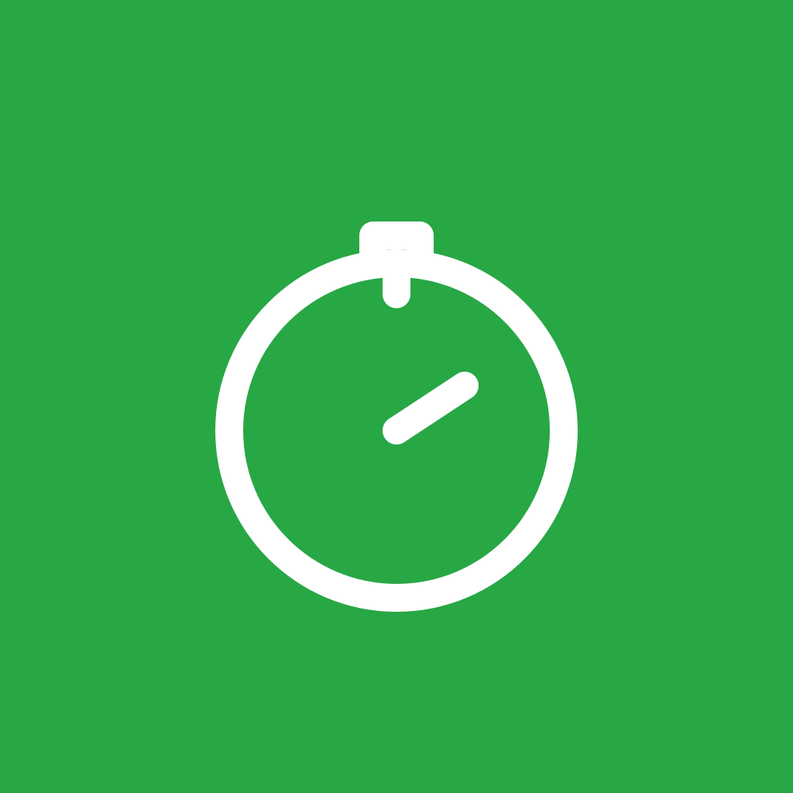

Offline-Werkzeug

> Fokus-Sessions nach Kategorie tracken.

Etabli Focus ist ein Pomodoro- und Fokus-Session-Tracker. Arbeitsblöcke werden nach Kategorie erfasst (Deep Work, Review, Admin, Forschung, Manuskript, Datenanalyse) mit konfigurierbaren Fokus- und Pausenzeiten und lokalen Benachrichtigungen. Timer überleben Force-Quit und Neustart. Vollständig offline.

{width=320}

## Wer profitiert davon

Wer Konzentrationsarbeit über mehrere Sitzungen hinweg sauber erfassen will — etwa zur Selbstkontrolle, zur Rechnungsstellung oder als Datengrundlage für eine bewusstere Arbeitsorganisation.

## Plattformen

| Plattform | Status |
|-----------|--------|
| iOS       | ✓      |
| Android   | ✓      |

## Datenschutz

Keine Analyse-Tools, keine Drittanbieter-SDKs. Die App arbeitet vollständig offline; Sessions und Kategorien liegen ausschließlich lokal auf dem Gerät.

## Installation

| Plattform | Bezug |
|-----------|-------|
| iOS       | App Store |
| Android   | Google Play und F-Droid (Haupt-Repository) |

Details siehe [Erste Schritte](getting-started.qmd).

## Unterstützen

Wenn dir die App nützt: [Liberapay](https://liberapay.com/rabanheller/) · in der App selbst findest du außerdem einen Buy-Me-a-Coffee-Link.
