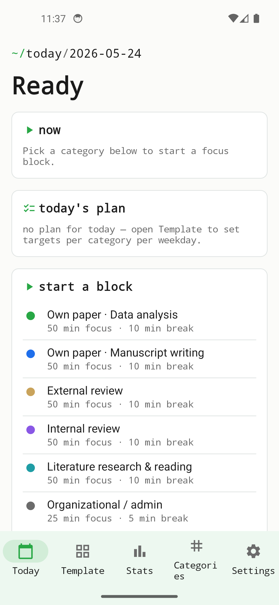
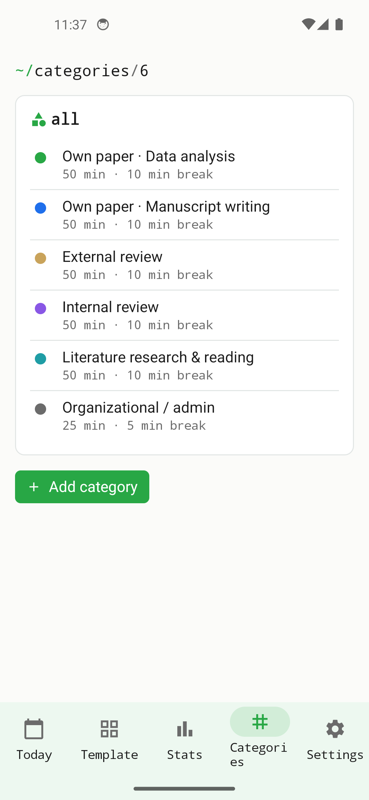
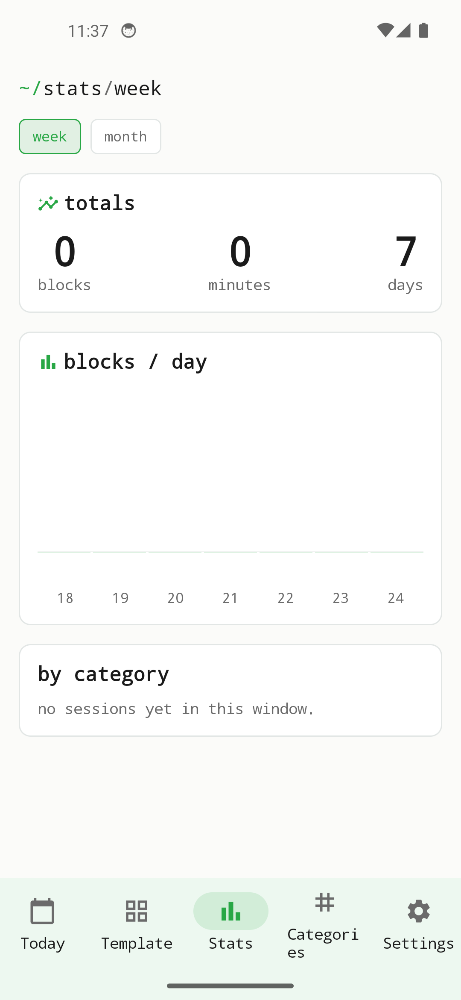
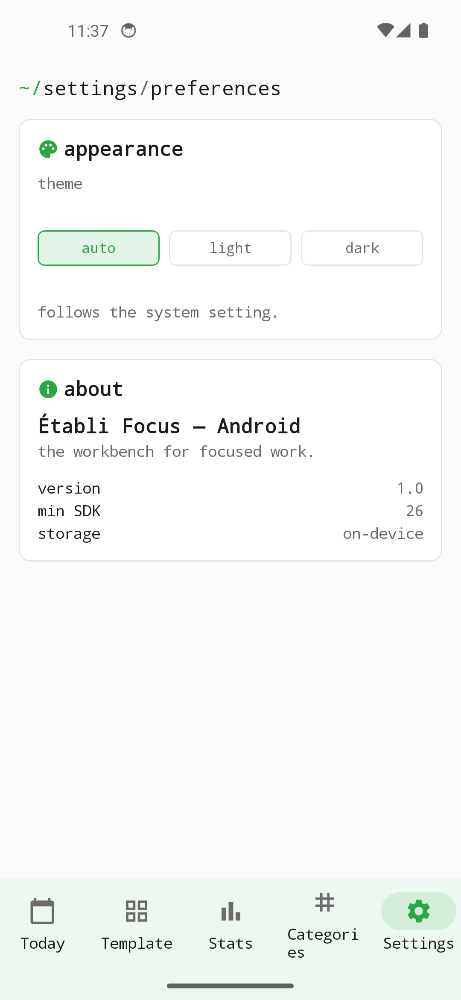

Focus is deliberately small: a timer, categories, history. Nothing beyond that.

## Modules

| Area | What it does |
|------|--------------|
| **Today** | Active timer, quick category pick, day overview of past sessions. |
| **Categories** | Built-in and custom categories with colour and default durations. |
| **History** | Past sessions per day/week, with totals per category. |
| **Settings** | Default focus and break duration, theme (Light/Dark/System). |

### Today view

Fastest way to a session: pick a category, start the timer, keep the day in sight.

{width=320}

### Categories

Preset categories are created at install; new ones can be added. Every category has a name and a colour reused across charts and history.

{width=320}

### History

Aggregated totals per category, by day and week — ideal for checking what the focus blocks were actually spent on.

{width=320}

### Settings

Default durations, theme, sounds and notifications — the important switches in one screen.

{width=320}

## Persistence

| What | Where |
|------|-------|
| Sessions, categories, settings | local database on the device. |
| Active timer state | persistent — survives force-quit and reboot, since start/end are stored with timestamps. |

## Notifications

| Trigger | Content |
|---------|---------|
| Focus time over | Break suggested. |
| Break time over | Hint that a new focus session can start. |

All notifications are **local** (`UNUserNotificationCenter` on iOS, `NotificationManager` on Android). There is no push service.

## Offline guarantee

There is no network activity. The app does not reach any server, nor send any telemetry.

## Where to get it

| Channel | App |
|---------|-----|
| App Store (iOS) · Google Play (Android) | Etabli Focus |
| F-Droid — main repository | Etabli Focus |
| Source code | [`etabli-dev/etabli-focus`](https://github.com/etabli-dev/etabli-focus) |
