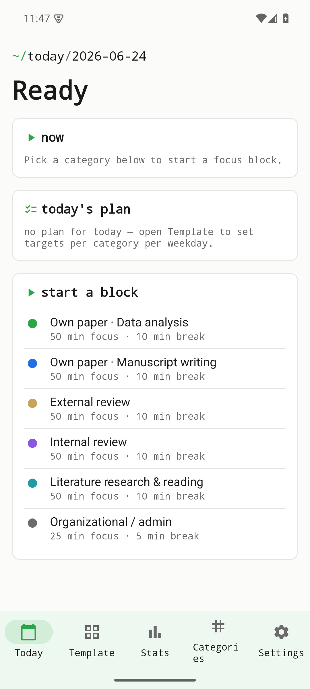
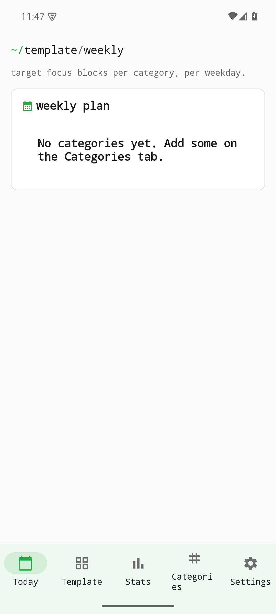
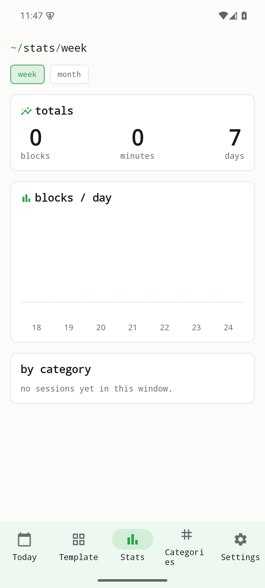
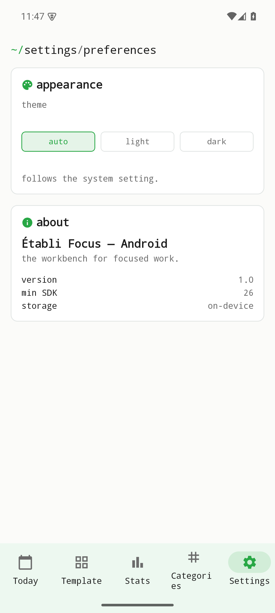

# Focus — Vignette & Tutorial (v0.1.0)

> **Établi Focus** is a Pomodoro / focus-session tracker, fully offline. You set
> per-weekday targets per category, start a timed focus block, and watch your
> stats build up over time. No accounts, no network, no telemetry — sessions live
> only on the device.
>
> **Stack:** native Android (Kotlin + Jetpack Compose), Room persistence. Part of
> the **établi** suite, on the shared Coder design system (accent `#28A745`,
> JetBrains Mono). Figures are real screenshots of the v0.1.0 build on an Android
> emulator, regenerated by `scripts/capture.sh`.

## Table of contents
1. [Quick start](#quick-start)
2. [Today](#feature-today)
3. [Starting a focus block](#feature-starting-a-focus-block)
4. [Template — weekday targets](#feature-template)
5. [Categories](#feature-categories)
6. [Stats](#feature-stats)
7. [Settings](#feature-settings)
8. [Reproducing these figures](#reproducing-these-figures)
9. [Version](#version)

## Quick start
Install `focus-0.1.0.apk`, open it, and allow notifications (used to signal the
end of a block). The app opens on **Today**, ready to start.



## Feature: Today
The home screen shows the current date as a terminal-style breadcrumb, a **now**
card (what's running, or a prompt to start), **today's plan** (your targets for
this weekday), and a **start a block** action.


## Feature: Starting a focus block
Tapping **start a block** expands the category picker — each category carries its
own focus/break durations (e.g. 50 min focus · 10 min break). Pick one to begin a
timed session.


## Feature: Template
**Template** is where you set targets per category per weekday, so "today's plan"
fills itself in automatically.



## Feature: Categories
**Categories** manages the focus categories themselves — name, colour, and the
default focus/break lengths used when you start a block.


## Feature: Stats
**Stats** rolls up your completed focus time so you can see effort across
categories and over time.



## Feature: Settings
**Settings** covers theme (light / dark / system), and the usual app preferences.



## Reproducing these figures
```bash
# build + install the debug APK on a booted emulator/device
( cd android && ./gradlew :app:assembleDebug )
adb install -r android/app/build/outputs/apk/debug/app-debug.apk
adb shell pm grant com.raban.etabli.focus.debug android.permission.POST_NOTIFICATIONS
# regenerate every figure
bash scripts/capture.sh
```
Device: 1080×2400 @ 420dpi, animations disabled. Slugs in `scripts/capture.sh`
map 1:1 to the filenames above.

## Version
Documents établi **Focus v0.1.0** (applicationId `com.raban.etabli.focus`,
versionCode 1). Part of the établi (workbench) suite.
